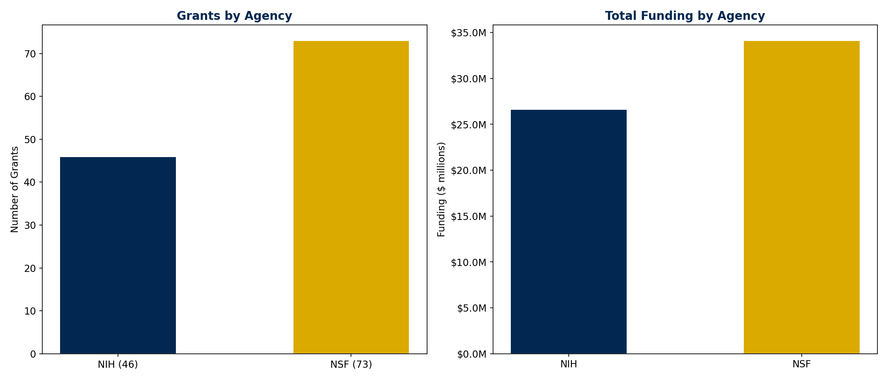
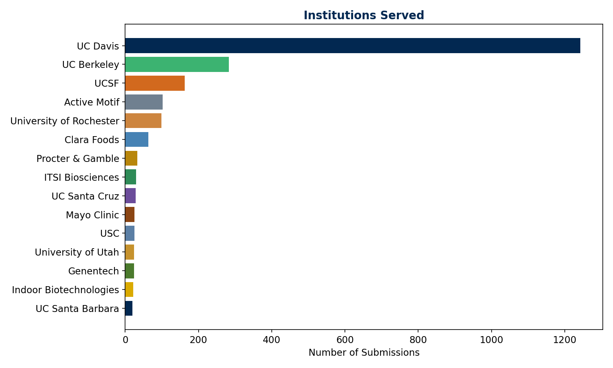
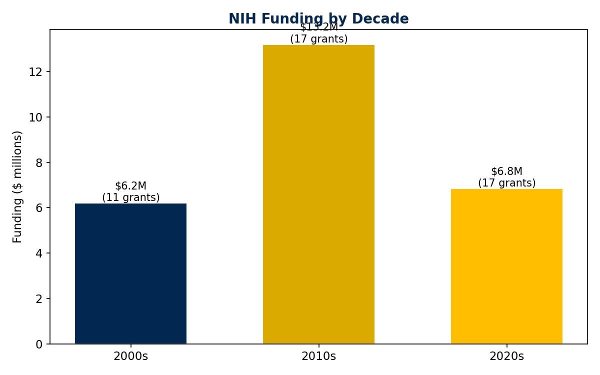
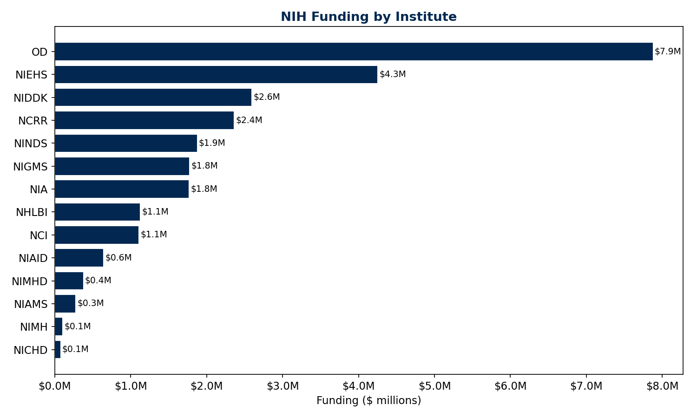
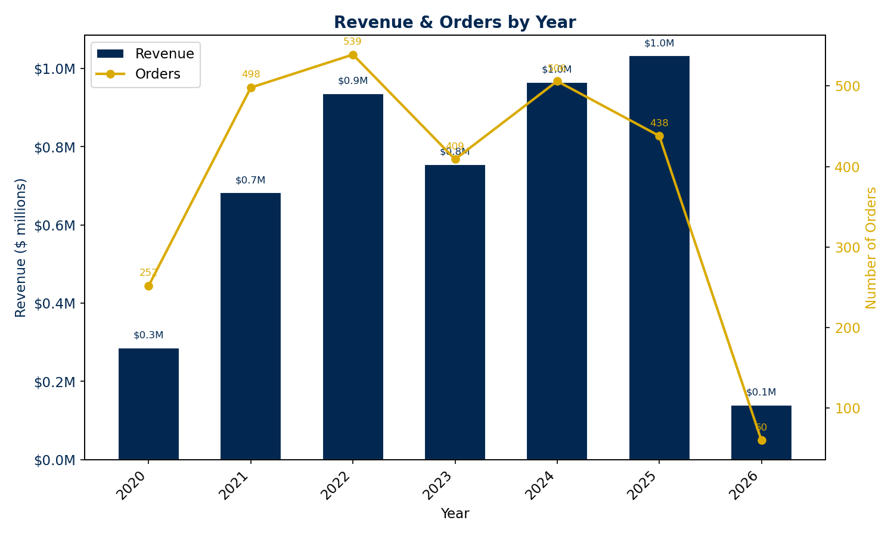
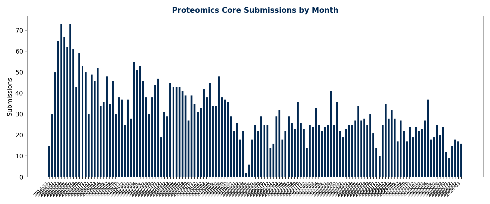
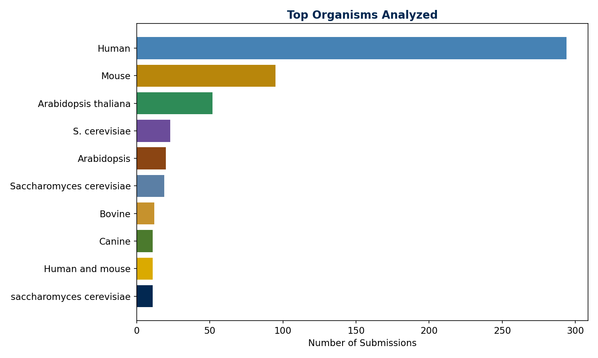
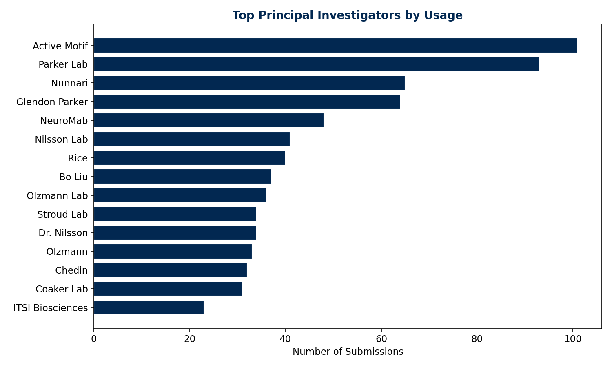
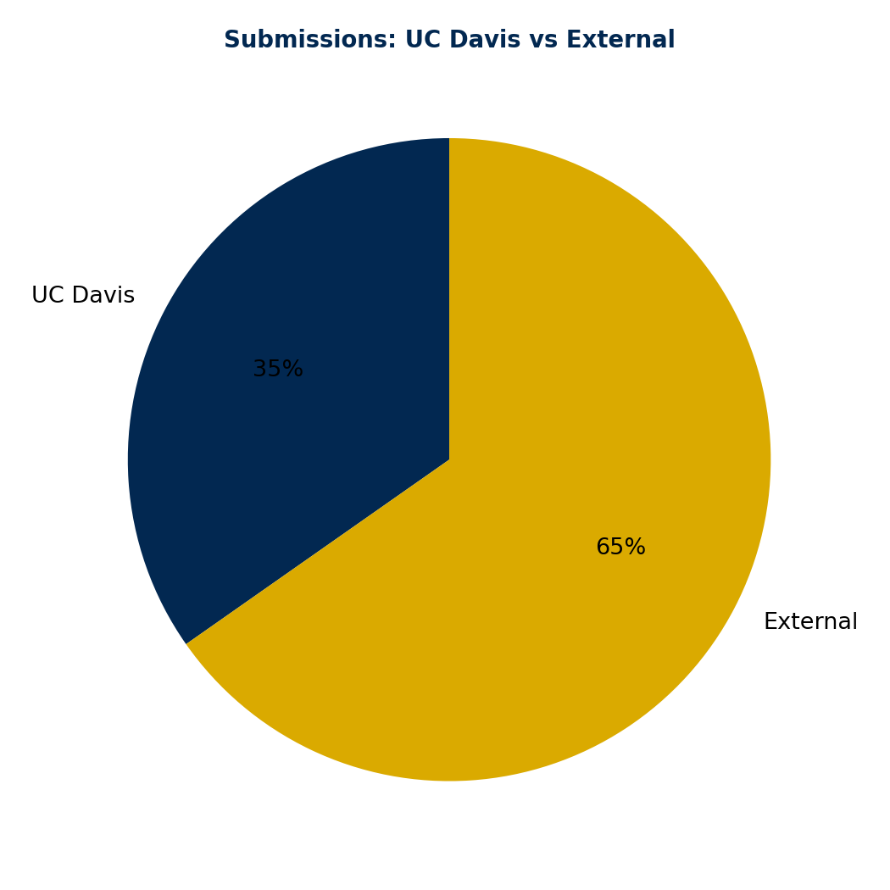

# UC Davis Proteomics Core Facility — Mass Spectrometry Impact Report

*Auto-generated on 2026-03-13*

**Source code & data:** [https://github.com/bsphinney/proteomics-core-site](https://github.com/bsphinney/proteomics-core-site)

*This report covers mass spectrometry services only (excludes Amino Acid Analysis).*

---

## Executive Summary

### Grant Funding

| Source | Grants | Total Funding | Active | Active Funding |
|--------|--------|---------------|--------|----------------|
| NIH | 45 | $26,237,787 | 7 | $2,353,574 |

### Core Usage (Submission System)

| Metric | Value |
|--------|-------|
| Date range | 2014-11-19 to 2026-03-13 |
| Total submissions | **4311** |
| Total samples processed | **8,866** |
| Unique principal investigators | **1514** |
| Unique submitters | **1590** |
| Institutions served | **643** |
| Repeat PI rate | **39%** |
| Data analysis requested | **1910** (44%) |

### Revenue & Services

| Metric | All Services | Mass Spec Only | AAA Only |
|--------|-------------|----------------|----------|
| Orders | 1,341 | 1,341 | 0 |
| Revenue | $4,102,861 | $4,102,861 | $0 |

### Revenue by Year

| Year | Orders | Revenue |
|------|--------|---------|

---

## NIH Grants

### Direct Instrument Grants (PI: Brett Phinney)

| Grant | Title | Year | Amount |
|-------|-------|------|--------|
| S10RR023642 | Applied biosystems Q-trap 4000 | 2008 | $491,160 |
| S10OD021801 | Phinney - Orbitrap Fusion ETD | 2016 | $600,000 |
| S10OD026918 | QE-HF-X Mass Spectrometer | 2020 | $600,000 |
| **Total** | | | **$1,691,160** |

### Funding by Decade

| Decade | Grants | Funding |
|--------|--------|---------|
| 2000s | 11 | $6,203,456 |
| 2010s | 17 | $13,193,186 |
| 2020s | 17 | $6,841,145 |

### NIH Institutes Represented

| Institute | Grants | Funding |
|-----------|--------|---------|
| OD | 5 | $7,879,596 |
| NIEHS | 6 | $4,255,207 |
| NIDDK | 2 | $2,598,331 |
| NCRR | 5 | $2,361,455 |
| NINDS | 6 | $1,877,257 |
| NIGMS | 6 | $1,775,254 |
| NIA | 2 | $1,768,603 |
| NHLBI | 3 | $1,129,330 |
| NCI | 4 | $1,107,985 |
| NIAID | 2 | $645,483 |
| NIMHD | 1 | $377,798 |
| NIAMS | 1 | $277,009 |
| NIMH | 1 | $105,790 |
| NICHD | 1 | $78,689 |

### Currently Active NIH Grants

| Grant | PI | Title | Funding |
|-------|----|-------|---------|
| T32GM144303 | Donald Bers | Training Program in Pharmacology | $479,169 |
| R21AI194167 | Bennett Penn | Identifying the Determinants of Persister Cell Sur | $404,108 |
| R01CA251253 | Chengfei Liu | Modulating HSP70/STUB1 machinery in therapy-resist | $362,398 |
| R37CA249108 | Chengfei Liu | Dissecting the Role of Proteostasis in Anti-Androg | $359,138 |
| U54NS127758 | HEIKE WULFF | Core A: Analytical and Medicinal Chemistry Core | $345,337 |
| R21AI185949 | Bennett Penn | Regulation of antibiotic tolerance in Mycobacteriu | $241,375 |
| P30CA093373 | Lihong Qi | Biostatistics Shared Resource | $162,049 |

### All NIH Grants

| Grant | PI | Title | Institute | Funding | Active |
|-------|----|-------|-----------|---------|--------|
| UM1OD023221 | KC LLOYD | KOMP2-Phase 2 Production and Phenotyping | OD | $6,058,702 | No |
| P42ES004699 | BRUCE HAMMOCK | Biomarkers of Exposure to Hazardous Subs | NIEHS | $2,588,040 | No |
| U24DK097154 | Oliver Fiehn | West Coast Central Comprehensive Metabol | NIDDK | $2,339,908 | No |
| P01AG025532 | Gino Cortopassi | A Mitochondrial Longevity Pathway: P66Sh | NIA | $1,434,113 | No |
| U2CES030158 | Oliver Fiehn | West Coast Metabolomics Center for Compo | NIEHS | $989,602 | No |
| G20RR021338 | PHYLLIS WISE | Animal Research Facility Improvements | NCRR | $635,000 | No |
| S10OD026918 | Brett Phinney | QE-HF-X Mass Spectrometer | OD | $600,000 | No |
| S10OD021801 | Brett Phinney | Phinney - Orbitrap Fusion ETD | OD | $600,000 | No |
| T32HL007013 | Nicholas KENYON | Training in Comparative Lung Biology and | NHLBI | $527,402 | No |
| S10RR023558 | JULIE LEARY | Thermo Finnigan LTQ-Orbitrap | NCRR | $499,009 | No |
| R01HL130261 | Elena Goncharova | HIPPO Signaling in Pulmonary Arterial Hy | NHLBI | $492,779 | No |
| S10RR022650 | BRUCE HAMMOCK | Acquisition of an LC-quadrupole time-of- | NCRR | $492,593 | No |
| S10RR023642 | Brett Phinney | Applied biosystems Q-trap 4000 | NCRR | $491,160 | No |
| S10OD025271 | William Jewell | Acquisition of a Q-Exactive Plus Mass Sp | OD | $485,813 | No |
| T32GM144303 | Donald Bers | Training Program in Pharmacology | NIGMS | $479,169 | Yes |
| U54NS079202 | BRUCE HAMMOCK | Analytical Chemistry | NINDS | $455,807 | No |
| R21NS133564 | Anna La Torre | Coordination of projection neuron fate a | NINDS | $422,449 | No |
| R21AI194167 | Bennett Penn | Identifying the Determinants of Persiste | NIAID | $404,108 | Yes |
| R35GM119574 | Hsin-Yi Ho | Deciphering Wnt-Ror signaling in cytoske | NIGMS | $392,500 | No |
| P60MD000222 | Kenneth Beckman | Core--Genomics/Proteomics Shared Resourc | NIMHD | $377,798 | No |
| R01CA251253 | Chengfei Liu | Modulating HSP70/STUB1 machinery in ther | NCI | $362,398 | Yes |
| R37CA249108 | Chengfei Liu | Dissecting the Role of Proteostasis in A | NCI | $359,138 | Yes |
| T32ES007059 | Laura Van Winkle | Advanced Training in Environmental Healt | NIEHS | $346,715 | No |
| U54NS127758 | HEIKE WULFF | Core A: Analytical and Medicinal Chemist | NINDS | $345,337 | Yes |
| R01NS109176 | Sergi Simo | Regulation of hippocampal morphogenesis  | NINDS | $343,438 | No |
| P30AG010129 | Charles DeCarli | UC Davis Alzheimer's Disease Core Center | NIA | $334,490 | No |
| P30GM092328 | Peter Cala | Recruitment into the UC Davis School of  | NIGMS | $329,500 | No |
| R01GM102225 | JOANNA CHIU | The role of DBT and NEMO-dependent phosp | NIGMS | $278,888 | No |
| P01AR052354 | ISSAC PESSAH | Mechanisms of dysregulating MH RyR1s and | NIAMS | $277,009 | No |
| R01GM049077 | CARLITO LEBRILLA | The development of methods to determine  | NIGMS | $272,543 | No |
| R01DK059470 | DIETMAR KÜLTZ | Mechanisms of renal cell adaptation to h | NIDDK | $258,423 | No |
| R00NS061952 | JOANNA CHIU | The role of clock protein phosphorylatio | NINDS | $249,000 | No |
| S10RR023555 | Laura Van Winkle | Acquisition of LMD6000 Laser Microdissec | NCRR | $243,693 | No |
| R21AI185949 | Bennett Penn | Regulation of antibiotic tolerance in My | NIAID | $241,375 | Yes |
| R21CA277171 | Chengfei Liu | Targeting intracrine steroidogenesis in  | NCI | $224,400 | No |
| P01ES011269 | BRUCE HAMMOCK | Core--analytical biomarkers (xenobiotics | NIEHS | $179,091 | No |
| P30CA093373 | Lihong Qi | Biostatistics Shared Resource | NCI | $162,049 | Yes |
| K01OD026526 | Luke Wittenburg | Defining the role of core binding factor | OD | $135,081 | No |
| P50HL085036 | David Rocke | Bioinformatices and Biostatistics Core | NHLBI | $109,149 | No |
| K01MH116389 | Annie Ciernia | Mapping Multi-Omics Networks in Microgli | NIMH | $105,790 | No |
| P30ES023513 | Deborah Bennett | Exposure Core | NIEHS | $84,979 | No |
| K99HD079561 | David Dallas | Deciphering the function of naturally oc | NICHD | $78,689 | No |
| K99ES024806 | Kin Sing Stephen Lee | Identifying the Receptors of Environment | NIEHS | $66,780 | No |
| F32NS108519 | Nicholas Vierra | Dynamic modulation of ionic and lipid si | NINDS | $61,226 | No |
| F32GM103090 | Megan Wemmer | Characterization of effectors and ER in  | NIGMS | $22,654 | No |

---

## Core Usage Analytics

### Institutions Served

| Institution | Submissions |
|-------------|-------------|
| UC Davis | 1242 |
| UC Berkeley | 283 |
| UCSF | 163 |
| Active Motif | 102 |
| University of Rochester | 99 |
| Clara Foods | 63 |
| Procter & Gamble | 33 |
| ITSI Biosciences | 30 |
| UC Santa Cruz | 29 |
| Mayo Clinic | 25 |
| USC | 25 |
| University of Utah | 24 |
| Genentech | 24 |
| Indoor Biotechnologies | 22 |
| UC Santa Barbara | 20 |
| University of Nevada, Reno | 20 |
| University of New Mexico | 19 |
| University of Washington | 18 |
| University of Oregon | 18 |
| Gladstone Institutes | 17 |

### UC Davis Departments

| Department / School | Submissions |
|---------------------|-------------|
| UC Davis (General) | 300 |
| Dept. of Plant Biology | 30 |
| UC Davis Health | 6 |
| Dept. of Toxicology | 5 |
| Dept. of Physiology and Membrane Biology | 4 |
| Dept. of Biochemistry and Molecular Medicine | 4 |
| Dept. of Dermatology | 3 |
| Dept. of Orthopaedic Surgery | 2 |
| Dept. of Microbiology and Molecular Genetics | 2 |
| Dept. of Surgery | 2 |
| Dept. of Pharmacology | 2 |
| Dept. of Molecular Biosciences UC Davis SVM | 1 |
| Dept. of Environment Toxicology | 1 |
| Dept. of Neurology | 1 |
| Dept. of Molecular & Cellular Biology | 1 |
| Dept. of Plant Science | 1 |
| Dept. of Biology | 1 |
| Dept. of Molecular and Cellular Biology | 1 |

### Top Principal Investigators

| PI | Submissions |
|----|-------------|
|  Active Motif | 101 |
|  Parker Lab | 93 |
|  Nunnari | 65 |
| Glendon Parker | 64 |
|  NeuroMab | 48 |
|  Nilsson Lab | 41 |
|  Rice | 40 |
| Bo Liu | 37 |
|  Olzmann Lab | 36 |
|  Stroud Lab | 34 |
|  Dr. Nilsson | 34 |
|  Olzmann | 33 |
|  Chedin | 32 |
|  Coaker Lab | 31 |
|  ITSI Biosciences | 23 |
|  Lebrilla | 22 |
|  Dr. Bo Liu | 21 |
|  Nunnari Lab | 21 |
| Steve George | 20 |
|  Giulivi | 19 |

### Organisms Analyzed

| Organism | Submissions |
|----------|-------------|
| Human | 294 |
| Mouse | 95 |
| Arabidopsis thaliana | 52 |
| S. cerevisiae | 23 |
| Arabidopsis | 20 |
| Saccharomyces cerevisiae | 19 |
| Bovine | 12 |
| Canine | 11 |
| Human and mouse | 11 |
| saccharomyces cerevisiae | 11 |
| homo sapiens | 10 |
| Triticum aestivum | 10 |
| E. coli | 10 |
| mus musculus | 10 |
| human and cytomegalovirus | 9 |

### Quarterly Submission Trends

| Quarter | Submissions |
|---------|-------------|
| 2014-Q4 | 45 |
| 2015-Q1 | 188 |
| 2015-Q2 | 202 |
| 2015-Q3 | 163 |
| 2015-Q4 | 133 |
| 2016-Q1 | 147 |
| 2016-Q2 | 118 |
| 2016-Q3 | 111 |
| 2016-Q4 | 100 |
| 2017-Q1 | 120 |
| 2017-Q2 | 150 |
| 2017-Q3 | 106 |
| 2017-Q4 | 110 |
| 2018-Q1 | 105 |
| 2018-Q2 | 129 |
| 2018-Q3 | 107 |
| 2018-Q4 | 105 |
| 2019-Q1 | 113 |
| 2019-Q2 | 113 |
| 2019-Q3 | 123 |
| 2019-Q4 | 87 |
| 2020-Q1 | 66 |
| 2020-Q2 | 26 |
| 2020-Q3 | 76 |
| 2020-Q4 | 64 |
| 2021-Q1 | 77 |
| 2021-Q2 | 69 |
| 2021-Q3 | 85 |
| 2021-Q4 | 63 |
| 2022-Q1 | 82 |
| 2022-Q2 | 71 |
| 2022-Q3 | 91 |
| 2022-Q4 | 77 |
| 2023-Q1 | 73 |
| 2023-Q2 | 88 |
| 2023-Q3 | 83 |
| 2023-Q4 | 45 |
| 2024-Q1 | 88 |
| 2024-Q2 | 77 |
| 2024-Q3 | 66 |
| 2024-Q4 | 67 |
| 2025-Q1 | 72 |
| 2025-Q2 | 74 |
| 2025-Q3 | 69 |
| 2025-Q4 | 36 |
| 2026-Q1 | 51 |

---

## Cross-Reference: Submission PIs with Grants

PIs who have both submitted samples AND have NIH/NSF grants:

| PI | Submissions | NIH Grants | NSF Awards |
|----|-------------|------------|------------|
| Bo Liu | 37 | R21CA277171, R01CA251253, R37CA249108 | — |
|  Lebrilla | 22 | R01GM049077 | — |
|  Dr. Bo Liu | 21 | R21CA277171, R01CA251253, R37CA249108 | — |
|  Carlito Lebrilla | 14 | R01GM049077 | — |
|  Penn | 13 | R21AI194167, R21AI185949 | — |
|  Bennett Penn | 8 | R21AI194167, R21AI185949 | — |
| Chengfei Liu | 5 | R21CA277171, R01CA251253, R37CA249108 | — |
| Luke Wittenburg | 4 | K01OD026526 | — |
|  Bruce Hammock | 4 | P42ES004699, S10RR022650, U54NS079202 (+1) | — |
| Elena Goncharova | 4 | R01HL130261 | — |
| Bennett Penn | 1 | R21AI194167, R21AI185949 | — |
| brett phinney | 1 | S10OD026918, S10OD021801, S10RR023642 | — |
|  Brett Phinney | 1 | S10OD026918, S10OD021801, S10RR023642 | — |
|  Phinney | 1 | S10OD026918, S10OD021801, S10RR023642 | — |
|  Dr. Kent Lloyd | 1 | UM1OD023221 | — |
|  Simo | 1 | R01NS109176 | — |
| Sergi Simo | 1 | R01NS109176 | — |
|  Pessah | 1 | P01AR052354 | — |
|  Dr. Lebrilla | 1 | R01GM049077 | — |

---

## Figures

### Grants Overview


### Institutions Served


### Nih Funding By Decade


### Nih Funding By Institute


### Revenue By Year


### Submissions By Month


### Top Organisms


### Top Pis By Submissions


### Ucd Vs External


---

## About This Report

This report is auto-generated by a Python script that queries 6 data sources.

**Source code:** [https://github.com/bsphinney/proteomics-core-site](https://github.com/bsphinney/proteomics-core-site)

### Data Sources

| Source | What It Provides |
|--------|-----------------|
| [NIH Reporter API](https://reporter.nih.gov/) | Federal grants referencing the proteomics core |
| [NIH iCite](https://icite.od.nih.gov/) | Citation counts and bibliometrics for publications |
| [NSF Award API](https://www.nsf.gov/awardsearch/) | NSF awards at UC Davis related to proteomics |
| [PubMed E-utilities](https://pubmed.ncbi.nlm.nih.gov/) | Publications by core personnel + grant acknowledgments |
| Stratocore/PPMS | Submission records and order/invoicing data (private) |
| PI Grant Discovery | Looks up each submission PI in NIH/NSF by name |

### Available Downloads

| File | Description |
|------|-------------|
| [`executive_summary.pdf`](https://github.com/bsphinney/proteomics-core-site/blob/main/reports/executive_summary.pdf) | One-page visual dashboard for leadership |
| [`impact_report_latest.md`](https://github.com/bsphinney/proteomics-core-site/blob/main/reports/impact_report_latest.md) | This report (comprehensive, all services) |
| [`impact_report_ms_only_latest.md`](https://github.com/bsphinney/proteomics-core-site/blob/main/reports/impact_report_ms_only_latest.md) | Mass spectrometry only (for S10 grant renewals) |
| [`impact_report_aaa_only_latest.md`](https://github.com/bsphinney/proteomics-core-site/blob/main/reports/impact_report_aaa_only_latest.md) | Amino acid analysis only |
| [`core_user_grants_*.csv`](https://github.com/bsphinney/proteomics-core-site/tree/main/reports) | PI-level grant data (backs the funding claims) |
| [`nih_grants_*.csv`](https://github.com/bsphinney/proteomics-core-site/tree/main/reports) | All NIH grants in spreadsheet form |
| [`nsf_awards_*.csv`](https://github.com/bsphinney/proteomics-core-site/tree/main/reports) | All NSF awards in spreadsheet form |
| [`impact_data.json`](https://github.com/bsphinney/proteomics-core-site/blob/main/reports/impact_data.json) | Machine-readable data for website integration |
| [`figures/*.png`](https://github.com/bsphinney/proteomics-core-site/tree/main/reports/figures) | All charts (9 total) |

### How to Re-run

```bash
pip install requests matplotlib
python scripts/impact_report.py              # Full run (~5 min)
python scripts/impact_report.py --skip-pubmed --skip-pi-lookup  # Fast (~30 sec)
```

The report also runs automatically on the 1st of every month via GitHub Actions.
